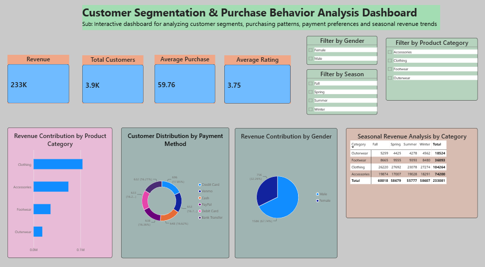
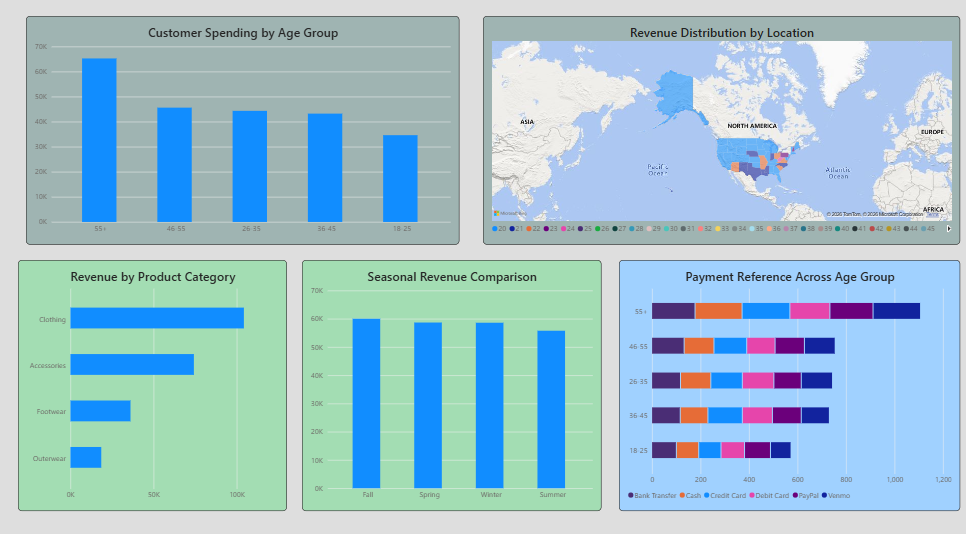
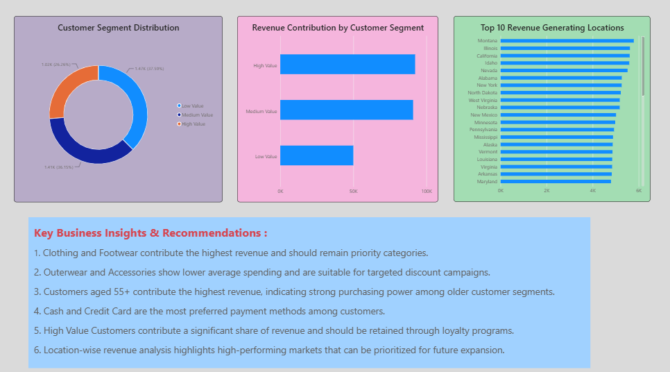

# Customer Segmentation & Purchase Behavior Analysis

> An end-to-end data analytics project analyzing customer purchase behavior using MySQL, Python, and Microsoft Power BI — covering revenue analysis, customer segmentation, payment preferences, and seasonal trends.

---

## 📊 Dashboard Preview

### Page 1 — Overview & Revenue Analysis


### Page 2 — Demographics & Seasonal Trends


### Page 3 — Customer Segmentation & Key Insights


---

## 🎯 Project Objective

This project analyzes a retail shopping dataset to:
- Measure core business KPIs: revenue, customer count, average purchase value, and ratings
- Identify patterns across product categories, demographics, payment methods, seasons, and locations
- Segment customers into **Low Value**, **Medium Value**, and **High Value** groups
- Develop actionable business recommendations for marketing, retention, and inventory planning

---

## 📁 Dataset

| Attribute | Details |
|-----------|---------|
| Source | Istanbul Shopping Mall Dataset |
| Records | ~3,900 customers |
| Scope | Multi-category retail transactions |
| Fields | Customer ID, age, gender, category, payment method, invoice date, price, quantity, location |

---

## 🛠️ Tools & Technologies

| Tool | Purpose |
|------|---------|
| **MySQL / phpMyAdmin** | Data storage, querying, and initial exploration |
| **Python** | Data cleaning and preprocessing |
| **Microsoft Power BI** | Interactive dashboard creation and visualization |
| **DAX** | Calculated measures and custom KPIs |
| **Excel** | Data validation |

---

## 📋 Methodology

1. **Data Extraction** — Dataset reviewed and queried in MySQL/phpMyAdmin
2. **Data Cleaning** — Exported as CSV, cleaned and preprocessed in Python
3. **Data Modeling** — Loaded into Power BI; calculated fields created for age groups and customer value segments
4. **Dashboard Design** — Built 3-page interactive Power BI report with filters for Gender, Product Category, and Season
5. **Insights & Recommendations** — Business recommendations derived from dashboard findings

---

## 📈 Dashboard Pages

### Page 1 — Business Overview
- **KPI Cards:** Total Revenue (233K), Total Customers (3.9K), Average Purchase (59.76), Average Rating (3.75)
- **Revenue by Product Category** (bar chart)
- **Customer Distribution by Payment Method** (donut chart)
- **Revenue Contribution by Gender** (pie chart)
- **Seasonal Revenue Analysis by Category** (matrix table)
- **Interactive Filters:** Gender | Product Category | Season

### Page 2 — Demographics & Trends
- **Customer Spending by Age Group** (bar chart)
- **Revenue Distribution by Location** (map visual)
- **Revenue by Product Category** (horizontal bar)
- **Seasonal Revenue Comparison** (column chart)
- **Payment Preference Across Age Groups** (stacked bar)

### Page 3 — Customer Segmentation
- **Customer Segment Distribution** (donut chart — Low / Medium / High Value)
- **Revenue Contribution by Customer Segment** (bar chart)
- **Top 10 Revenue-Generating Locations** (bar chart)
- **Key Business Insights & Recommendations** (summary panel)

---

## 🔍 Key Findings

| Finding | Insight |
|---------|---------|
| 💰 Total Revenue | USD 233K across ~3.9K customers |
| 👗 Top Category | Clothing generates the highest revenue |
| 👴 Top Age Group | Customers aged **55+** contribute the highest revenue |
| 💳 Payment Method | Cash and Credit Card are most preferred |
| 🗺️ Top Locations | Montana, Illinois, California lead in revenue |
| 🏆 High Value Segment | Contributes a significant share of total revenue |

---

## 💡 Business Recommendations

1. **Retain High Value customers** — Introduce loyalty rewards and personalized offers
2. **Upsell Medium Value customers** — Use bundles and cross-selling to shift them to High Value
3. **Re-engage Low Value customers** — Apply targeted discount coupons to improve conversion
4. **Inventory planning** — Prioritize Clothing and Footwear in high-revenue locations
5. **Age-targeted campaigns** — Design marketing offers tailored to the 55+ segment
6. **Payment-based offers** — Create payment-method specific promotions (e.g., cashback for credit card users)

---

## 📂 Repository Structure

```
Customer-Segmentation/
│
├── Dashboard_Page_1.png                        # Dashboard screenshot - Overview
├── Dashboard_Page_2.png                        # Dashboard screenshot - Demographics
├── Dashboard_Page_3.png                        # Dashboard screenshot - Segmentation
├── Customer_Segmentation_Analytics_Report.docx # Full analytical report
├── Customer_Segmentation_Presentation.pptx     # Project presentation (10 slides)
├── customer_segmentation_dashboard.html        # HTML export of dashboard
└── README.md
```

---

## 🚀 How to View

- **Power BI Dashboard:** Open the `.pbix` file in Microsoft Power BI Desktop (free download)
- **Report:** Open `Customer_Segmentation_Analytics_Report.docx` for full written analysis
- **Presentation:** Open `.pptx` for the 10-slide project summary

---

## 👤 Author

**Korupolu Pradeep Kumar**  
MBA Finance | Aspiring Data Analyst  
📧 korupolupradeepkumar@gmail.com  
🔗 [LinkedIn](https://linkedin.com/in/korupolu-pradeep-kumar)  
🐙 [GitHub](https://github.com/Pradeepkumark7)

---

## 🏷️ Tags

`Power BI` `MySQL` `Python` `Customer Segmentation` `Data Analytics` `DAX` `Business Intelligence` `Retail Analytics` `MBA Finance`
